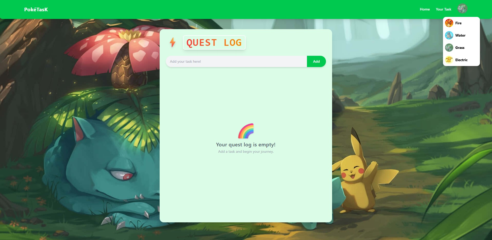

# 🔥 PokéTasK – Pokemon Themed Todo-List

PokéTasK is a beautifully themed, Pokémon-inspired todo app with theme switching, smooth animations, and persistent storage using `localStorage`.

---

## 🖼️ Preview



> _Above: Example of PokéTasK in "Grass" theme_

---
## 🌈 Live Demo

🔗 **Live Demo**: [https://flare3416.github.io/Poketask/](https://flare3416.github.io/Poketask/)

---

## ✨ Features

- 🔁 **Persistent Tasks** with `localStorage`
- 🎨 **4 Themes**: Fire, Water, Grass, Electric
- 📋 **Add, Edit, Complete, Delete Tasks**
- 🖼️ **Dynamic Backgrounds** per theme
- ⚡ **Responsive & Accessible Design**
- 🎮 **Minimalist Pokémon Vibe**

---

## 🚀 Tech Stack

- **React**
- **Vite**
- **Tailwind CSS**
- **uuid** for unique task IDs
- **gh-pages** for deployment

---


## 🧩 Folder Structure

```
Poketask/
├── public/
│   ├── theme-1profile.png
│   ├── background-1.jpg
│   └── ...other theme images
├── src/
│   ├── components/
│   │   └── Navbar.jsx
│   ├── App.jsx
│   └── main.jsx
├── vite.config.js
├── package.json
└── README.md
```

---

## 🛠️ Setup Instructions

1. **Clone the repo**

```bash
git clone https://github.com/flare3416/Poketask.git
cd Poketask
npm install
npm run dev

